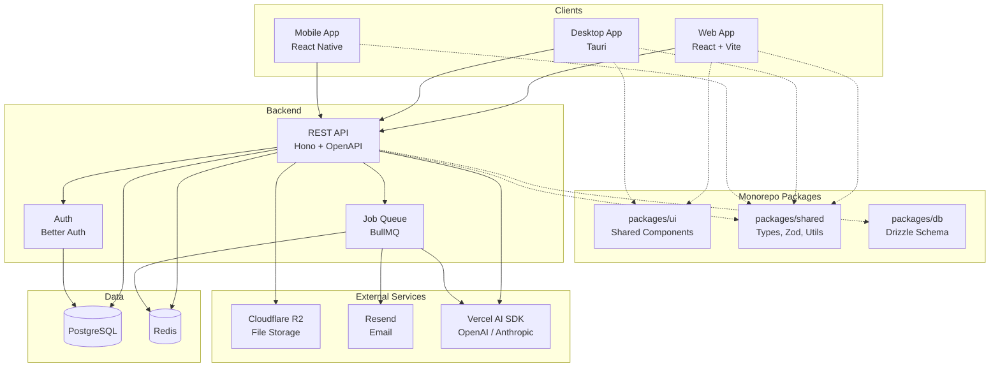
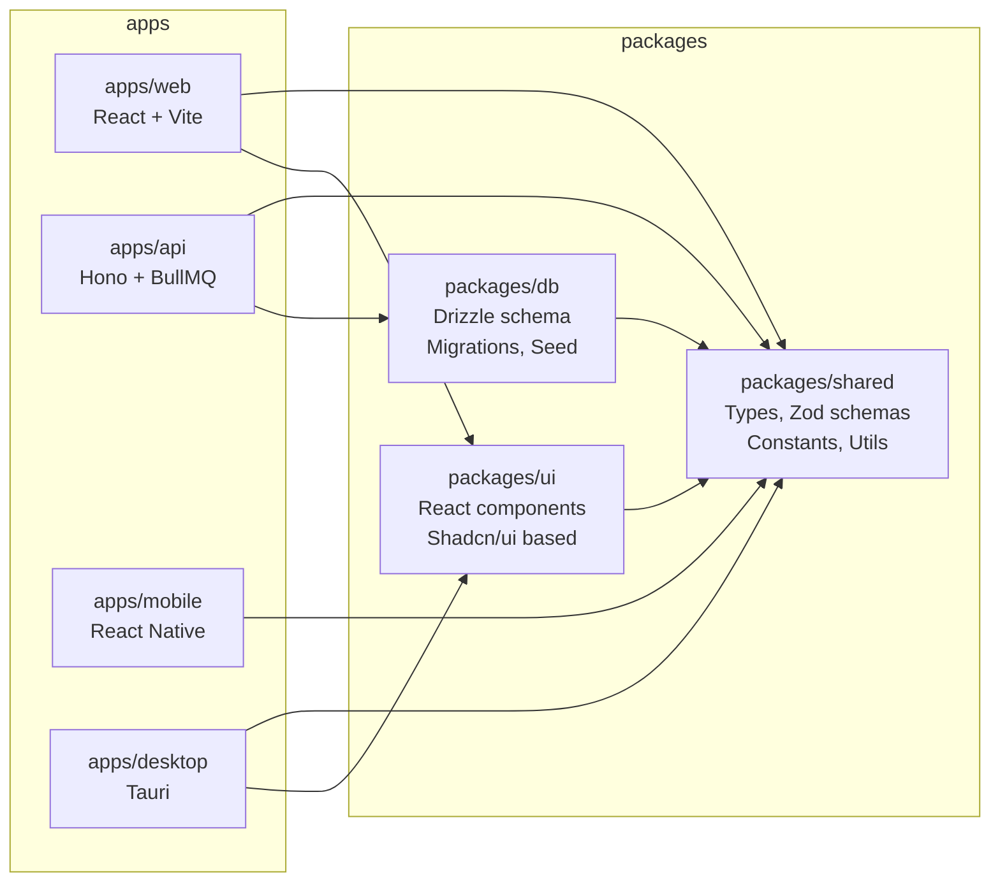
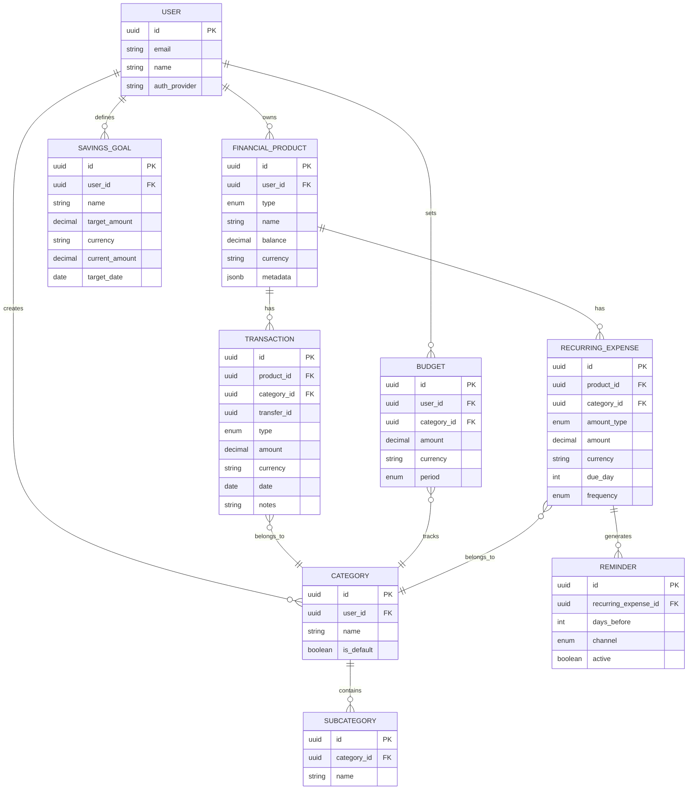
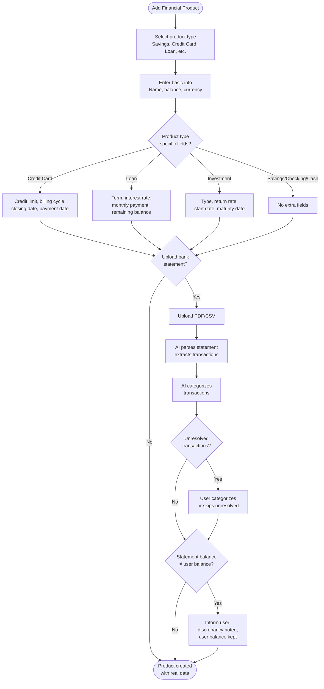
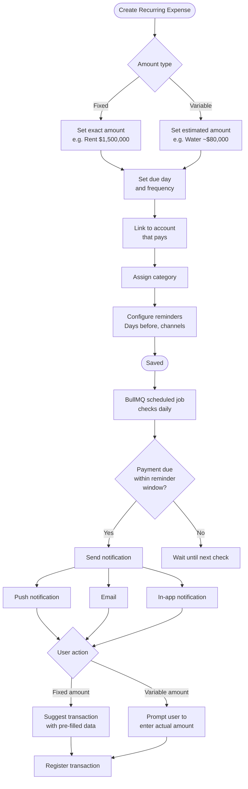
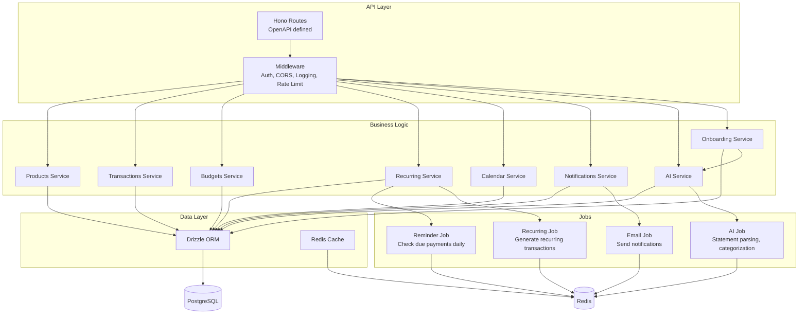
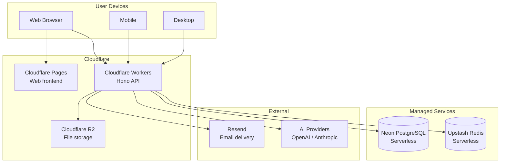
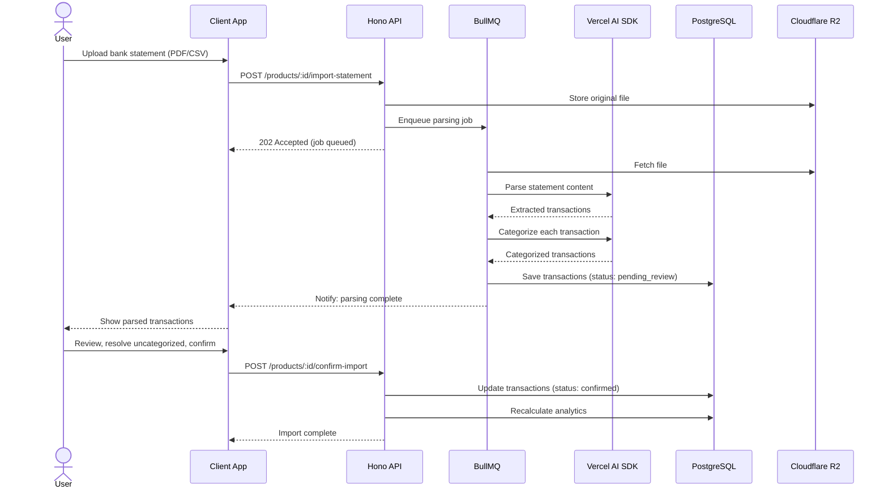

# Rumbo - Architecture and Flow Diagrams

## System Architecture

High-level view of how all components connect.

## Monorepo Structure

How code is organized and dependencies flow between packages.

## Data Model

Core entities and their relationships.

**Financial product types**: savings, checking, credit_card, loan_free_investment, loan_mortgage, investment_cdt, investment_fund, investment_stock, cash

**Transaction types**: income, expense, transfer

Transfer implementation (double entry):
- A transfer creates two transactions with the same `transfer_id`.
- Source account: `expense` for the amount.
- Destination account: `income` for the amount.
- Reporting should exclude transfer pairs from income/expense totals unless explicitly requested.

**Recurring expense amount types**: fixed (same every period), variable (amount changes, date stays)

## Balance Convention and Currency Rules

Balance sign convention:
- **Asset accounts** (savings, checking, cash, investments): `balance` is the user's owned value. Positive means they have money/assets.
- **Liability accounts** (credit cards, loans): `balance` is the amount owed. Positive means debt.

How transactions affect balances:
- **Asset accounts**: `income` increases balance, `expense` decreases balance.
- **Liability accounts**: `income` decreases balance (payments reduce debt), `expense` increases balance (charges increase debt).

Currency rules (MVP):
- Every financial product has a `currency` (COP or USD).
- Transactions must match the product currency.
- Budgets and savings goals are single-currency.
- Transfers are only allowed between accounts with the same currency.

## Financial Product Onboarding Flow

This flow is non-trivial due to optional statement scanning, AI categorization, and the balance source-of-truth rule.

## Recurring Expenses and Reminder Pipeline

Shows how background jobs handle recurring expense tracking and multi-channel notifications.

## Backend API Structure

Internal organization of the API layer, business logic, data access, and background jobs.

## Deployment Architecture

## Statement Scanning Flow (Extra Feature)

Async flow showing how bank statement import works across multiple services.

